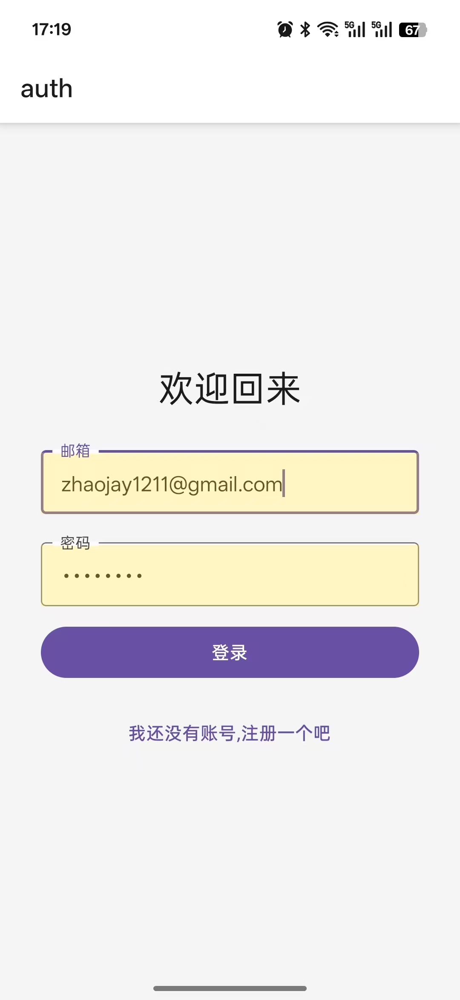

# Welcome to my Expo habit app 👋

一个使用 [Expo](https://expo.dev/) + [Appwrite](https://appwrite.io/) 构建的跨平台习惯养成应用.

## 技术栈

React Native / Expo
Appwrite 云数据库
React Native Paper UI 组件库
Expo Router 路由管理

## 功能介绍

- 用户注册/登录
- 添加、删除习惯
- 习惯打卡，自动统计连续天数
- 今日习惯列表，左滑删除，右滑打卡
- 习惯排行榜，展示最佳连续打卡记录
- Appwrite 云端数据存储与实时同步

## 项目说明

1. 安装依赖

```sh
   npm install
```

2. 配置 Appwrite 云服务，填写 .env 文件中的相关参数

```sh
EXPO_PUBLIC_APPWRITE_PROJECT_ID
EXPO_PUBLIC_APPWRITE_PROJECT_NAME
EXPO_PUBLIC_APPWRITE_ENDPOINT

EXPO_PUBLIC_DB_ID
EXPO_PUBLIC_DB_HABIT_COLLECTION_ID
EXPO_PUBLIC_DB_HABIT_COMPLETIONS_COLLECTION_ID
```

3. 启动项目

```sh
npm run start
```

4. 使用 Expo Go 扫码预览，或运行 npm run ios / npm run android

## 截图演示

1. 登录/注册功能
   

2. 登录后,可以查看当前用户所保存的习惯
   

3. 添加习惯
   
   

4. 删除
   

5. 完
   

6. 查看习惯保持的排行榜
   
